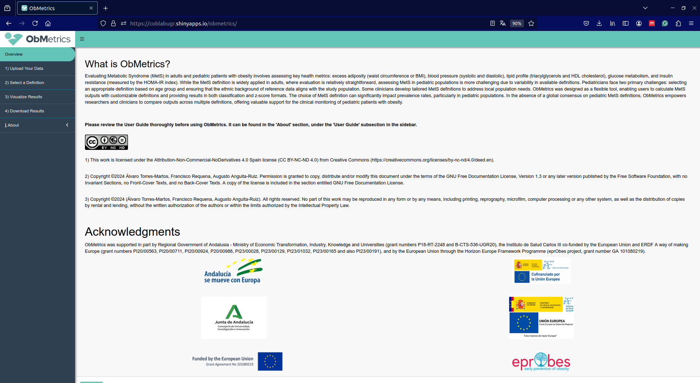

## Overview

This repository provides essential information about ObMetrics, a free and user-friendly Shiny app currently in its **alpha version**, designed to streamline the calculation of **outcomes** related to **Metabolic Syndrome** in **pediatric populations**. As an alpha release, it is being actively improved based on user feedback to ensure its reliability and functionality. The app is part of an article accepted in Pediatric Obesity and is under continuous development. Thus, if you use ObMetrics, cite us using the following reference: 

- **Torres-Martos Á, Requena F, López-Rodríguez G, et al. ObMetrics: A Shiny app to assist in metabolic syndrome assessment in paediatric obesity. Pediatric Obesity. 2025;e70016. doi:10.1111/ijpo.70016**

The manuscript is open access and can be freely accessed through the following link:

- **Article**:
  - **Journal Website**: [https://onlinelibrary.wiley.com/doi/full/10.1111/ijpo.70016](https://onlinelibrary.wiley.com/doi/full/10.1111/ijpo.70016)
  - **University of Granada Institutional Repository (DIGIBUG)**: https://digibug.ugr.es/handle/10481/103956
  
<div align="center">
  
  <p><strong>Graphical abstract.</strong> Overview of the necessity for standardised MetS definitions, with particular attention to conflicting definitions. The central workflow outlines the four main steps: Data input, selection of MetS definitions, visualisation of results, and data export. The case study section demonstrates differences in MetS prevalence across Hispanic-American and Hispanic-European cohorts, highlighting significant ethnic-specific variations in cardiometabolic profiles. This highlights the need for ethnically tailored assessment tools. ObMetrics provides a user-friendly interface, designed to standardise MetS evaluation, with the potential to enhance the comparability and rigor of paediatric obesity research.</p>
</div>

## Usage

The **ObMetrics app** is accessible from any modern web browser. You can launch the application by clicking the following link or scanning the QR code:

-   [Click here to access ObMetrics.](https://coblabugr.shinyapps.io/obmetrics/)


Once the app is loaded, users can input clinical and anthropometric data, such as waist circumference, blood pressure, lipids, glucose, and insulin levels. The app will automatically compute relevant outcomes based on the definitions selected by the user. The specific inputs needed for ObMetrics, along with their units, are listed in the following table: 

| **Inputs**             | **Description and units**                                                                                 |
|-----------------------|-------------------------------------------------------------------------------------------------|
| **id**                | Unique numeric identifier for each participant.                                                        |
| **decimal_age**       | Age in years, expressed as a decimal.                                                           |
| **sex**               | Coded as 0 for males and 1 for females.                                                         |
| **height_m**          | Height in meters.                                                                              |
| **weight_kg**         | Weight in kilograms.                                                                            |
| **wc_cm**             | Waist circumference (WC) in centimeters.                                                        |
| **dbp_mmHg**          | Diastolic blood pressure (DBP) in millimeters of mercury.                                       |
| **sbp_mmHg**          | Systolic blood pressure (SBP) in millimeters of mercury.                                        |
| **tag_mg_dl**         | Triglycerides (TAG) in milligrams per deciliter (mg/dL).                                        |
| **hdlc_mg_dl**        | High-density lipoprotein cholesterol (HDL-C) in milligrams per deciliter (mg/dL).               |
| **glucose_mg_dl**     | Glucose in milligrams per deciliter (mg/dL).                                                    |
| **insulin_microU_ml** | Insulin in micro-international units per milliliter (μU/mL).                                    |
| **tanner_index**      | Tanner stage, coded as 1 for prepubertal, and 2–3–4–5 for pubertal stages.                      |


Note that not all variables are necessary for every calculation; required fields depend on the chosen MetS criteria. Refer to the Documentation for more details.

## Quick start

1.  Open the web app using the link above.
2.  Input patient data into the relevant fields.
3.  Select the definition for Metabolic Syndrome.
4.  View and download the results in a ready-to-use format.





## Documentation

All supporting documentation, including the **User Manual** and **Tutorial**, can be found within the application itself under the "About" section. The User Guide provides step-by-step instructions on how to input data and interpret the results, as well as explanations for the different **definitions** and **reference tables**. Also, the User Guide can be found in this [webpage](https://github.com/AlvaroTorresMartos/ObMetrics/blob/master/Documentation.pdf).


<!--## Supplementary material

The supplementary materials for the manuscript (currently under review) that introduces ObMetrics are hosted on this [webpage](https://github.com/AlvaroTorresMartos/ObMetrics/tree/main/supplementary_material). These documents include additional methodological details and other supporting information to complement the main text of the paper.

-->

## Software and beta testing 

This app has been thoroughly validated through standard software engineering testing methodologies. This process included unit testing, integration testing, system testing, and regression testing to ensure the correctness, reliability, and stability of the code. Additionally, the application was evaluated by a group of expert beta testers from the relevant field, who provided critical insights into its functionality and usability in real-world scenarios. Their feedback was incorporated to optimize performance and ensure the software meets the specific needs and expectations of its intended users.

A dedicated usability assessment was conducted using the following questionnaire: [Usability Form](<https://forms.gle/t87LZpL2hBX72uQK9>).

## Feedback and contributions

The development team behind **ObMetrics** is committed to ongoing improvements and updates to the tool. We encourage users to report any issues or suggest new features via:

1. **GitHub Issues**: Report bugs or feature requests directly on this repository.
2. **Email**: Send detailed bug reports to [alvarotorres\@ugr.es](mailto:alvarotorres@ugr.es). Please include screenshots, descriptions of the issue, and any error messages encountered.
3. **Survey**: Help us improve by completing a brief [usability](<https://forms.gle/t87LZpL2hBX72uQK9>) survey after using the app.

Contributions in the form of suggestions for new **reference tables**, additional **features**, or other **enhancements** are also welcome. If you are a healthcare professional or researcher with specific needs, we invite you to share your thoughts.

## License

This repository is licensed under the Creative Commons Attribution-NonCommercial-NoDerivatives 4.0 International License (CC BY-NC-ND 4.0). For full details, please see the LICENSE.md file in this repository.


## Citation

If ObMetrics has contributed to your research, we kindly ask that you cite our work in your publications. Proper citation helps acknowledge the efforts behind this project and supports further development.

Please use the following citation:

**Torres-Martos Á, Requena F, López-Rodríguez G, et al. ObMetrics: A Shiny app to assist in metabolic syndrome assessment in paediatric obesity. Pediatric Obesity. 2025;e70016. doi:10.1111/ijpo.70016**

Alternatively, you can use the following BibTeX entry for your reference manager:

```bibtex
@article{TorresMartos2025,
  title = {ObMetrics: A Shiny app to assist in metabolic syndrome assessment in paediatric obesity},
  ISSN = {2047-6310},
  url = {http://dx.doi.org/10.1111/ijpo.70016},
  DOI = {10.1111/ijpo.70016},
  journal = {Pediatric Obesity},
  publisher = {Wiley},
  author = {Torres‐Martos,  Álvaro and Requena,  Francisco and López‐Rodríguez,  Guadalupe and Hernández‐Cabrera,  Jhazmin and Galván,  Marcos and Solís‐Pérez,  Elizabeth and Romo‐Tello,  Susana and Jasso‐Medrano,  José Luis and Vilchis‐Gil,  Jenny and Kl\"{u}nder‐Kl\"{u}nder,  Miguel and Martínez‐Andrade,  Gloria and Enríquez,  María Elena Acosta and Aristizabal,  Juan Carlos and Ramírez‐Mena,  Alberto and Stratakis,  Nikos and Bustos‐Aibar,  Mireia and Gil,  Ángel and Gil‐Campos,  Mercedes and Bueno,  Gloria and Leis,  Rosaura and Alcalá‐Fdez,  Jesús and Aguilera,  Concepción María and Anguita‐Ruiz,  Augusto},
  year = {2025},
  month = may, 
  pages = {e70016}
}
```


## Funding 

ObMetrics was supported in part by Regional Government of Andalusia - Ministry of Economic Transformation, Industry, Knowledge and Universities (grant numbers P18-RT-2248 and B-CTS-536-UGR20), the Instituto de Salud Carlos III co-funded by the European Union and ERDF A way of making Europe (grant numbers PI20/00563, PI20/00711, PI20/00924, P20/00988, PI23/00028, PI23/00129, PI23/01032, PI23/00165 and also PI23/00191), and by the European Union through the Horizon Europe Framework Programme (eprObes project, grant number GA 101080219).

<p align="center">
  
  
  
  
  
  
</p>
